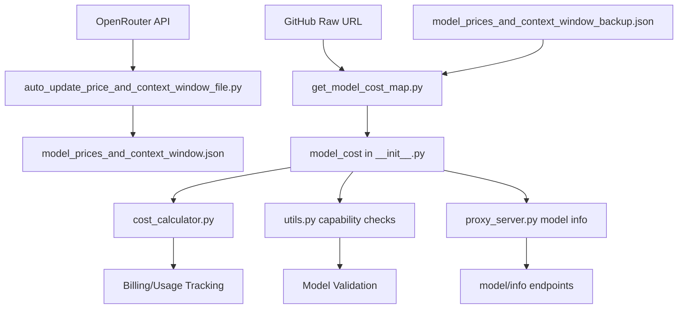

# Components Related to `model_prices_and_context_window.json`

## Overview

The `model_prices_and_context_window.json` file serves as LiteLLM's central data source for model pricing, capabilities, and context window information. This analysis identifies all components that interact with this critical configuration file.

## Core Data Structure

**Location**: `/model_prices_and_context_window.json`

**Contains**:

- **Pricing data**: `input_cost_per_token`, `output_cost_per_token`, reasoning tokens, batch pricing
- **Context limits**: `max_tokens`, `max_input_tokens`, `max_output_tokens`  
- **Model capabilities**: Function calling, vision, audio, system messages, web search, prompt caching
- **Provider mappings**: Which `litellm_provider` serves each model
- **Specialized costs**: Image generation, file search, vector storage, computer use
- **Regional support**: Supported regions and deprecation dates

## Read Components

### Core Library (`litellm/`)

- **`litellm/__init__.py:268`** - Initializes `model_cost` from remote URL via `get_model_cost_map()`
- **`litellm/utils.py`** - Multiple functions for model capability checks:
  - `supports_system_messages()` - Checks if model supports system messages
  - `supports_web_search()` - Checks web search capability  
  - `supports_url_context()` - Checks URL context support
  - `_supports_factory()` - Generic capability checker
- **`litellm/cost_calculator.py`** - Calculates billing costs using pricing data from the JSON file
- **`litellm/litellm_core_utils/get_model_cost_map.py`** - Fetches from GitHub raw URL with fallback to backup

### Proxy Server (`litellm/proxy/`)

- **`proxy_server.py:get_litellm_model_info()`** - Enriches model configurations with pricing/capability data
- **`proxy/_types.py`** - Type definitions referencing model data
- Used in `/model/info` endpoints and model management operations

### Provider-Specific Integration

- **`litellm/llms/vertex_ai/common_utils.py`** - Vertex AI cost calculations
- **`litellm/llms/bedrock/image/cost_calculator.py`** - Bedrock image pricing calculations

### Health Check Integration

- **`litellm/litellm_core_utils/health_check_helpers.py`** - Uses model data for health checks

## Write/Update Components

### Automated Updates

- **`.github/workflows/auto_update_price_and_context_window_file.py`** - Primary update mechanism:
  - Fetches data from OpenRouter API (`https://openrouter.ai/api/v1/models`)
  - Transforms and merges data into local JSON file
  - Updates pricing and context window information automatically
  - Handles model capability detection (vision support, etc.)

### Manual Update Tools

- **`cookbook/misc/update_json_caching.py`** - Manual update script for specific models like GPT-4o variants and embedding models

### Fallback System

- **`litellm/model_prices_and_context_window_backup.json`** - Embedded backup used when remote fetch fails
- **Environment variable**: `LITELLM_LOCAL_MODEL_COST_MAP=True` forces local backup usage

## Data Flow Architecture

## Key Integration Points

### Cost Calculation

- **`litellm/cost_calculator.py:24`** - Imports pricing utilities that reference this data
- Handles complex pricing scenarios including batch pricing, reasoning tokens, and specialized costs

### Model Validation

- **`litellm/utils.py`** - Uses this data for 40+ model capability checks
- Validates model support for features before API calls

### Proxy Configuration

- **Proxy server** enriches YAML config models with pricing data from this file
- Provides accurate model information via management endpoints

### Router System

- **`litellm/router.py`** - Uses pricing data for load balancing decisions
- Considers cost factors in routing logic

## File References Summary

The file is referenced by **44 files** across:

### Core Components

- `litellm/utils.py` - Model capability validation
- `litellm/cost_calculator.py` - Cost calculation engine
- `litellm/__init__.py` - Core initialization
- `litellm/litellm_core_utils/get_model_cost_map.py` - Data loading mechanism

### Proxy Components

- `litellm/proxy/proxy_server.py` - Model info enrichment
- `litellm/proxy/_types.py` - Type definitions

### Provider-Specific

- `litellm/llms/vertex_ai/common_utils.py` - Vertex AI integration
- `litellm/llms/bedrock/image/cost_calculator.py` - Bedrock image costs

### Testing & Documentation

- 30+ test files validate pricing and capability data
- 20+ documentation files reference model information
- UI components use pricing data for dashboard display

## Update Mechanisms

### Remote Data Source

- **Primary URL**: `https://raw.githubusercontent.com/BerriAI/litellm/main/model_prices_and_context_window.json`
- **Fallback**: Local backup file when remote unavailable
- **Update frequency**: Automated via GitHub workflow

### Data Synchronization

- **OpenRouter integration**: Fetches latest model data from OpenRouter API
- **Merge strategy**: Updates existing models, adds new ones
- **Transformation**: Converts OpenRouter format to LiteLLM schema

## Configuration Options

### Environment Variables

- `LITELLM_LOCAL_MODEL_COST_MAP=True` - Forces use of local backup
- Model cost map URL configurable via `litellm.model_cost_map_url`

### Runtime Behavior

- **Timeout**: 5-second timeout for remote fetch
- **Error handling**: Graceful fallback to backup on network issues
- **Caching**: Data loaded once at initialization

## Impact and Dependencies

This central data store enables:

- **Unified pricing** across 100+ LLM providers
- **Capability validation** before API calls
- **Cost tracking** and billing accuracy  
- **Router decisions** based on model costs
- **Proxy enrichment** of model configurations
- **Documentation accuracy** for supported models

The file serves as the single source of truth for model metadata, making it critical for LiteLLM's operation across all provider integrations.
